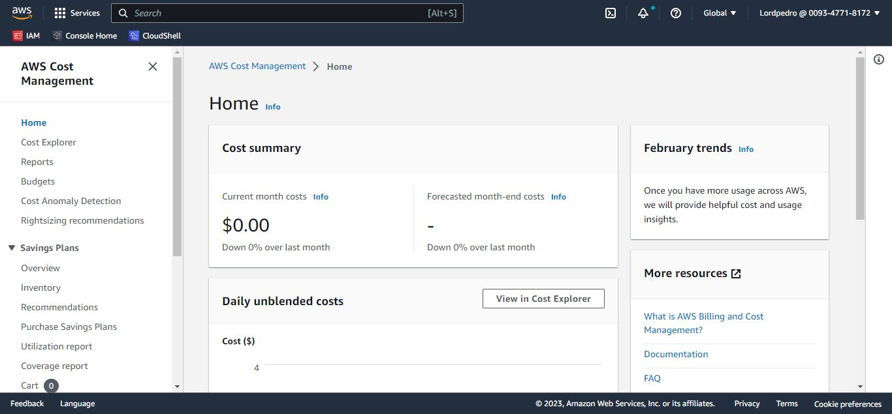
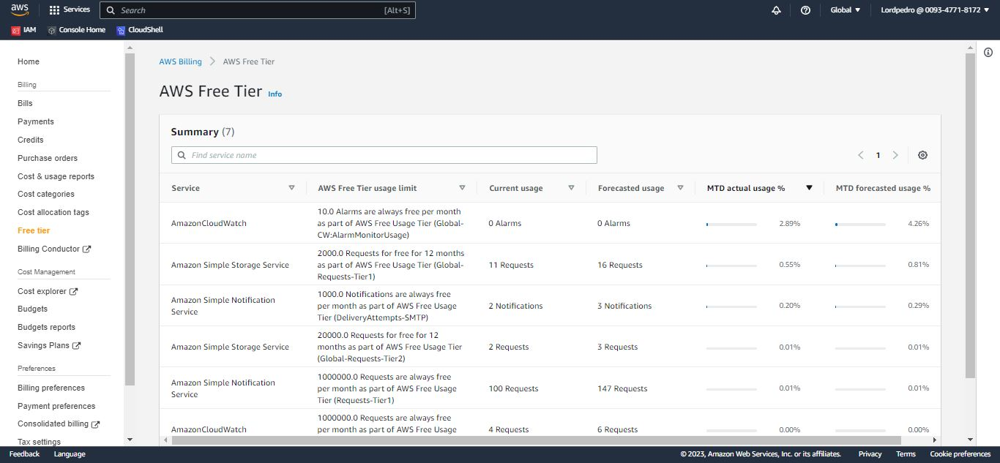
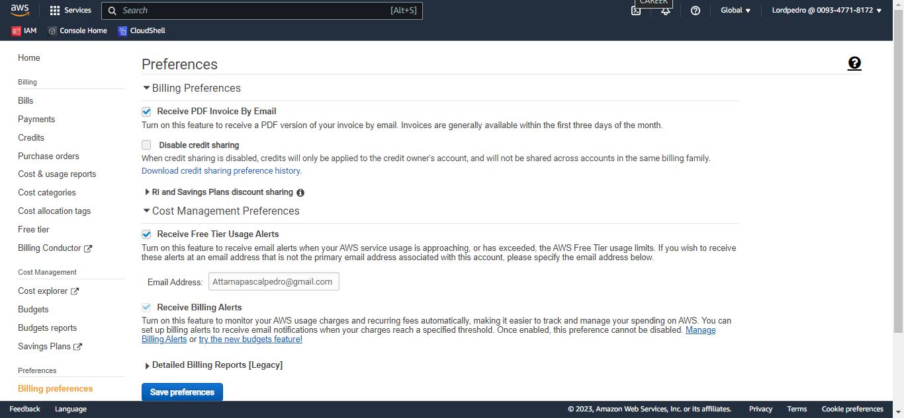
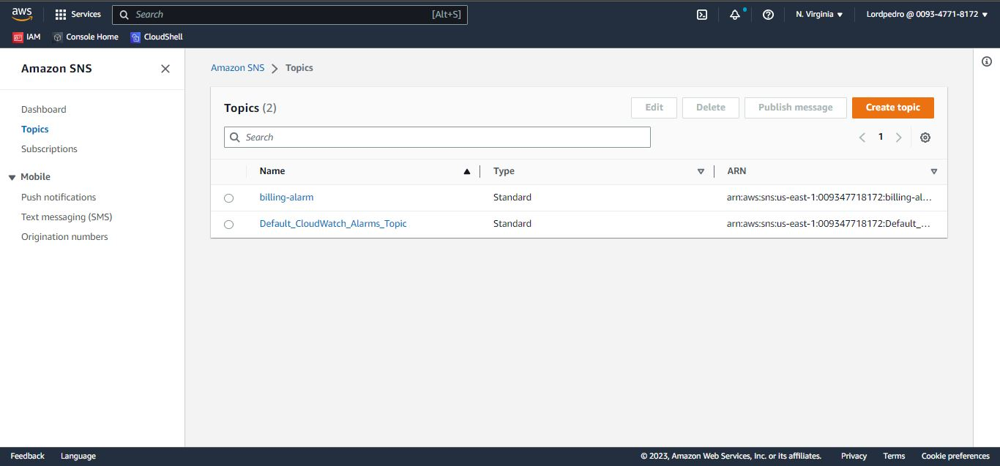
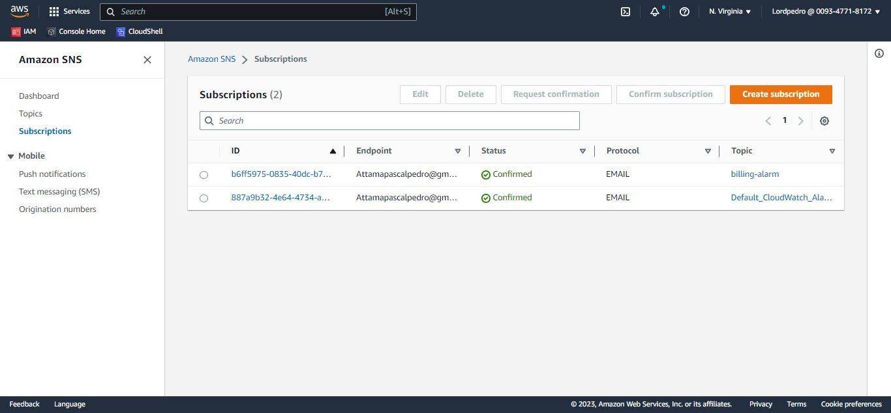
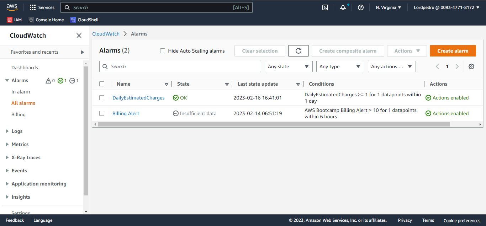
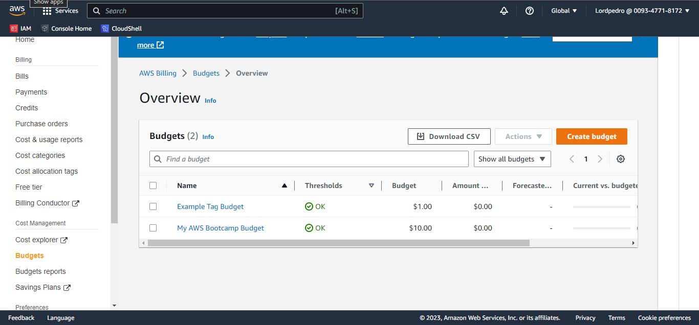
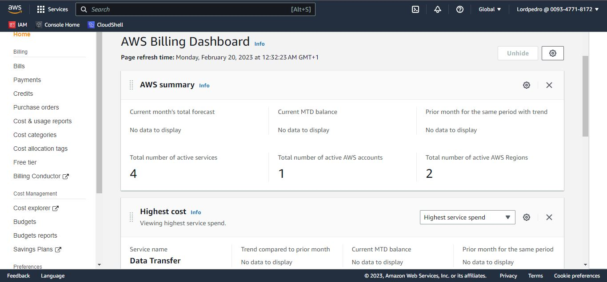
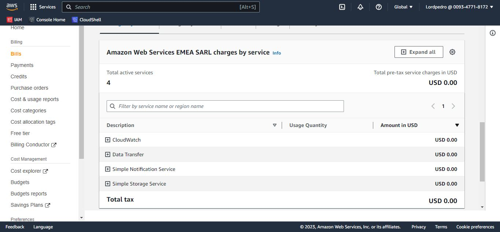
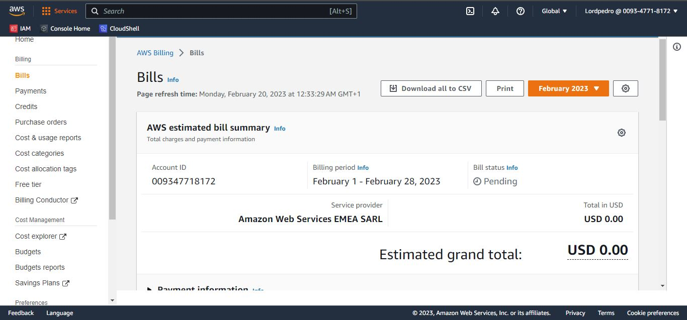

# WEEK 0 - BILLINGS & ARCHITECTURE!!!
### THIS IS A REVIEW WEEK

- This serves as a review of AWS basic Cloud settings and some necessary tools required for an efficient workload.

This review serves as a prerequisite to the main project that we are about to embark on. These reviews focused on these four major areas which are:

## AWS Cost Managements: 

Cost is a very sensitive issue that if not monitored might lead to the accumulation of unwanted billings within a time frame.


Therefore, I set up measures that will curtail random, unplanned, and accumulation of expenses during the project. 

This involves:

- Verified services that are within the AWS free tier by visiting [Free Tier](https://aws.amazon.com/free/).


- Turned on Billing alerts to receive notifications via emails by going to the [Billing Page](https://console.aws.amazon.com/billing/) navigate to the 'Billing preferences' and tick the 'Receive Billing Alerts' box.


- Created a billing alarm system using the SNS topic which triggers notifications when a certain threshold is surpassed using [aws sns create-topic](https://docs.aws.amazon.com/cli/latest/reference/sns/create-topic.html).


I created a SNS Topic by
```sh
aws sns create-topic --name billing-alarm
```
which returns a TopicARN

I then created a subscription to supply the TopicARN and my Email using
```sh
aws sns subscribe \
    --topic-arn TopicARN \
    --protocol email \    
    --notification-endpoint my@email.com    
```

Then, i checked my email and confirm the subscription.


- Configured the AWS CloudWatch metrics alarm which is a simple “pay for what you used” system by going to [aws cloudwatch put-metric-alarm](https://docs.aws.amazon.com/cli/latest/reference/cloudwatch/put-metric-alarm.html). It doesn’t involve an up-front commitment or minimum fee. You will be charged at the end of the month for your usage.


- Configured the AWS Budgeting pricing which is the max amount of cost that can be used in a particular task or a period.


- Implemented the best practices for reviewing and monitoring our monthly billing systems. 





## AWS Security:

This involves measures and precautions taken to avoid data loss, data breach, and tampering of credentials by third parties.
This involves:
(a) Made sure that the root user isn’t actively in use by setting up an IAM user account.
(b) Set up a user group with Admin privileges.
(c) Enabled Admin privileges on the IAM user account and enable certain policies which are required for full functionalities.
(d) Enabled an MFA on the IAM user for a 2FA.
(e) Set up AWS credentials using AWS environment variables.

## AWS Usage: 
The AWS Cloud is made up of servers that are mainly running on the Linux OS and tools such as:
(a) AWS Cloud Shell, a browser-based shell, used in running scripts with the AWS Command Line Interface (CLI).
(b) Created a Git repo for the project where the documentations and source codes for the entire app will be stored. Also integrated my Git account with Gitpod, a cloud development environment that provides online virtual computers for coding and development. Its isolates you from your local environs.
I made sure I got familiar with the AWS CLI which runs on Linux OS by default and was able to initiate commands comfortably. Also linked my AWS CLI with my Gitpod CDE by creating a “.gitpod.yml file” which automatically integrates the AWS CLI setting into my Gitpod account.

## The Project Model & Architecture:
 This involves the rough sketch and overview of the project. It gives you a visual framework of the system that you are about to embark on. It is similar to the architectural design of a building. It is the framework that helps to know and understand the model representation. It involves:
(a) The conceptual Diagram: which represents the general structure of data required to carry out a project. It focuses mainly on “WHAT” a model represents.
(b) The Logical Architectural Diagram: the visual representation of how a system works. It focuses mainly on “HOW” a system works and the relationship between each of the entities.

I was able to sketch out the architectural design of this project using the Lucid Chart application which has support for AWS architectural icons for easier simulation of the project Model overview. With these designs, I was able to discover the best ideas, go through the details, demonstrate functionalities, visualize user flow, and illustrate the required interactions needed. It also helped me in discovering potential issues and the solutions that can be applied.

Thanks & Stay tuned….